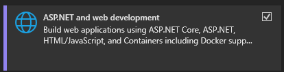

# Go Figure
Go figure is a mock website for selling Warhammer 40k models/figures. The purpose of this site is to get experience building a functional web page and database using .NET core, and EF core.  

## Features
Databse with CRUD functionality for eCommerce site
- Add new models/figures
- Get data on existing models already in the database
- Update data on existing models
- Delete data from the database
- Post on the web page to sell

## Getting Started
- Install the latest [Visual Studio](https://visualstudio.microsoft.com/)

- Install the following workloads
    - 
    - 
    - 
